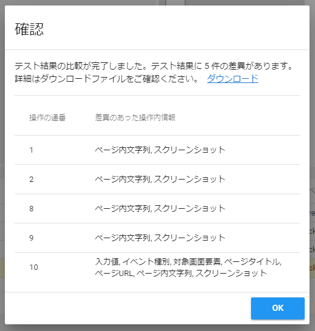

# テスト結果比較機能 操作説明書

テスト結果比較機能は、既存のテスト結果とリプレイしたテスト結果を比較し、差分を検出する機能です。  
差分はテスト結果内の各操作内情報(入力値や操作対象画面要素等)やスクリーンショットに対して検出されます。  
テスト結果比較機能は記録ツールでのみ利用可能です。

:warning: スクリーンショットの比較は現在 PNG 形式のみ対応しております。 **スクリーンショットの比較を行いたい場合は、画像圧縮設定にて画像の圧縮を OFF にしてください。**

テスト結果の比較を行うには、リプレイ時のテスト結果を保存する必要があります。  
保存方法については、「[リプレイ結果の保存](#リプレイ結果の保存)」を参照してください。

## リプレイ結果の保存


記録ツールヘッダ部のメニューボタンから「テスト結果のリプレイ」を選択するとダイアログが表示されます。


ダイアログ上で「リプレイ結果を保存する」チェックボックスを ON にし、「OK」ボタンからリプレイを実行すると、リプレイ時のテスト結果を保存することができます。  
また、**保存したテスト結果はリプレイ元のテスト結果と差分比較ができるようになります**。


保存するテスト結果は任意の名前を付与することができます。

:warning: デフォルトではリプレイ元のテスト結果と同名のため、適宜名称を変更してください。


「リプレイ結果を保存する」を ON にしてリプレイした場合、リプレイ終了後にリプレイ元のテスト結果と比較するかどうかを確認するダイアログが表示され、OK ボタンを押下するとテスト結果の比較をすることができます。



比較が完了すると確認ダイアログが表示され、出力された差分情報をダウンロードすることができます。  
差分情報の詳細は「[比較結果の確認](#比較結果の確認)」を参照してください。

## 既存のリプレイ結果の比較


一度保存したリプレイ結果は、「過去のテスト結果の読み込み」から読み込んだ後、記録ツールヘッダ部のメニューボタンから「テスト結果の比較」を選択することで、いつでもリプレイ元のテスト結果と差分比較することができます。

:bulb: リプレイ元が見つからないテスト結果(リプレイ結果以外のテスト結果)を読み込んでいる場合は、「テスト結果の比較」は非活性になり選択できません。

## 比較結果の確認

テスト結果の比較を行うと、差分情報が zip ファイル(`compare_YYYYMMDD_HHmmss.zip`)で出力されます。  
出力ファイル(zip)内の構成は以下の通りです。

```bash
compare_YYYYMMDD_HHmmss/
    ├ screenshots/ # 差分画像
    │       ├ aaaaa_bbbbb.png # リプレイ結果側の画像名_リプレイ元のテスト結果側の画像名.png
    │       └ xxxxx_yyyyy.png # リプレイ結果側の画像名_リプレイ元のテスト結果側の画像名.png
    │
    └ diffs.json # 差分情報
```

### screenshots ディレクトリ

画像に差異があった場合、差分画像が出力されます。差分画像では差異があった箇所が赤く色付けされます。

### diffs.json

- 比較したテスト結果の差分情報です(JSON 形式)。  
  操作毎の差異が配列で出力されます。  
  差異がない操作は`{}`(空オブジェクト)が出力されます。

  例:

  - 操作 1: 差異なし
  - 操作 2: **差異あり**
  - 操作 3: 差異なし

  の場合

  ```json
  [
    {},
    {
      "input": {
        "a": "aaa",
        "b": "bbb"
      }
    },
    {}
  ]
  ```

- 操作毎の差異は以下の形式で出力されます。

  ```jsonc
  "input": { // 差異があった項目名
    "a": "aaa", // a: リプレイ元のテスト結果側の値
    "b": "bbb" // b: リプレイ結果側の値
  }
  ```

  差異は操作時に記録した情報の内、以下項目に対して抽出されます。

  | 項目名         | 説明               |
  | -------------- | ------------------ |
  | input          | 入力値             |
  | type           | イベント種別       |
  | elementInfo    | 対象画面要素       |
  | title          | ページタイトル     |
  | url            | ページ URL         |
  | screenElements | ページ内文字列     |
  | screenshot     | スクリーンショット |

  :bulb: screenshot に差分があった場合は、値ではなく画像ファイルパスが出力されます。

  ```jsonc
  "screenshots": {
    "a": "screenshots/xxxxx.png", // a: screenshots/リプレイ元のテスト結果側の画像名.png
    "b": "screenshots/yyyyy.png" // b: screenshots/リプレイ結果側の画像名.png
  }
  ```

## テスト結果比較の設定


設定画面の「テスト結果比較の設定」から比較対象等をカスタマイズできます。

### 指定した操作内情報の差分を検出しない

操作時に記録した情報の内、比較時に無視する項目を指定することができます。

### 指定した画面要素の差分を検出しない

比較時に無視する画面要素のタグ名を指定することができます。
